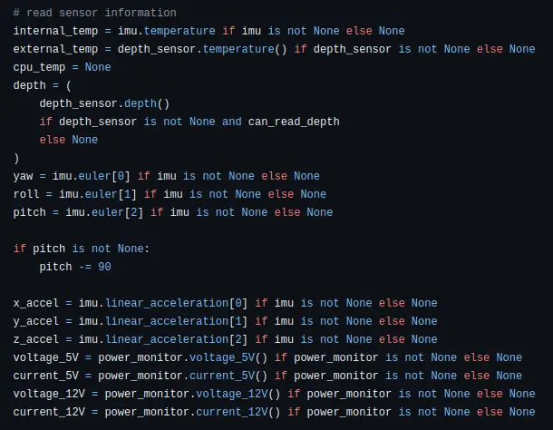
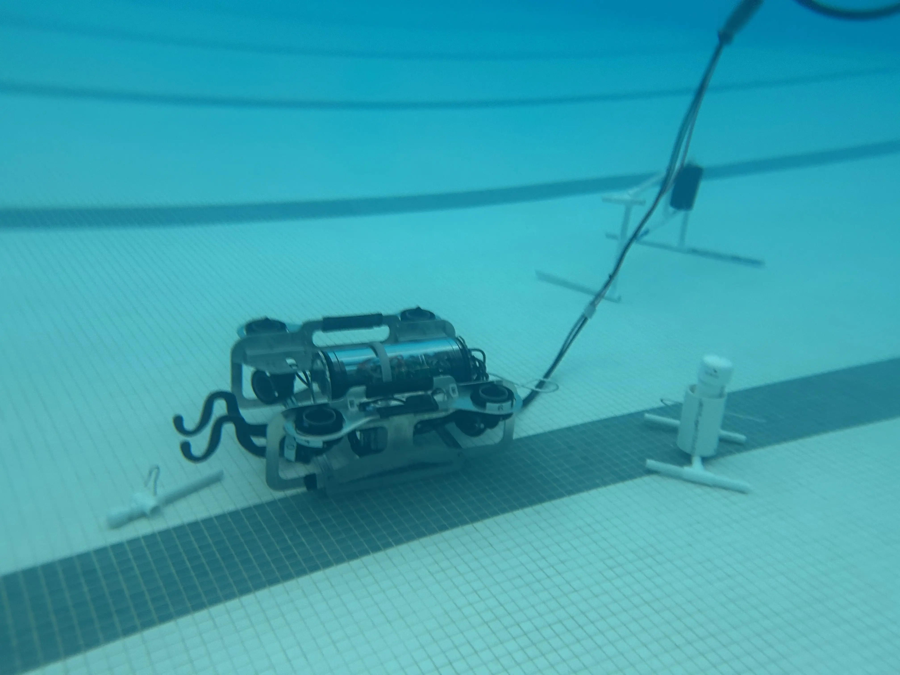
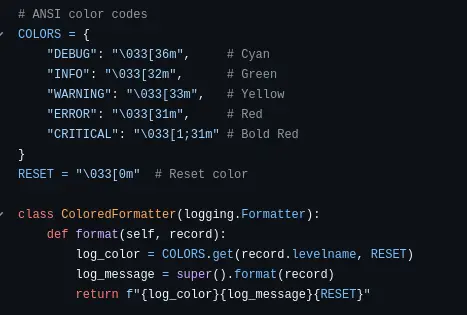
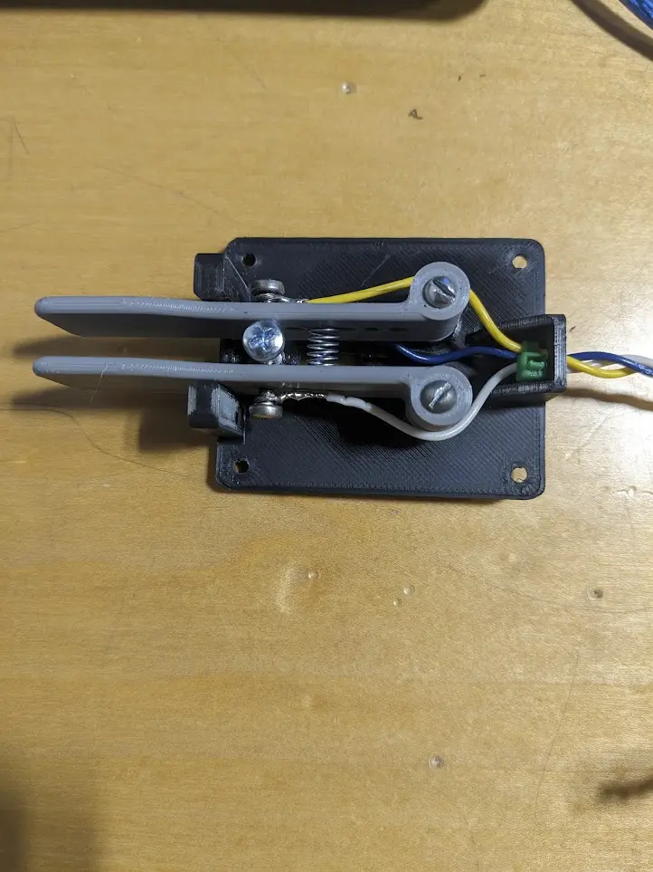
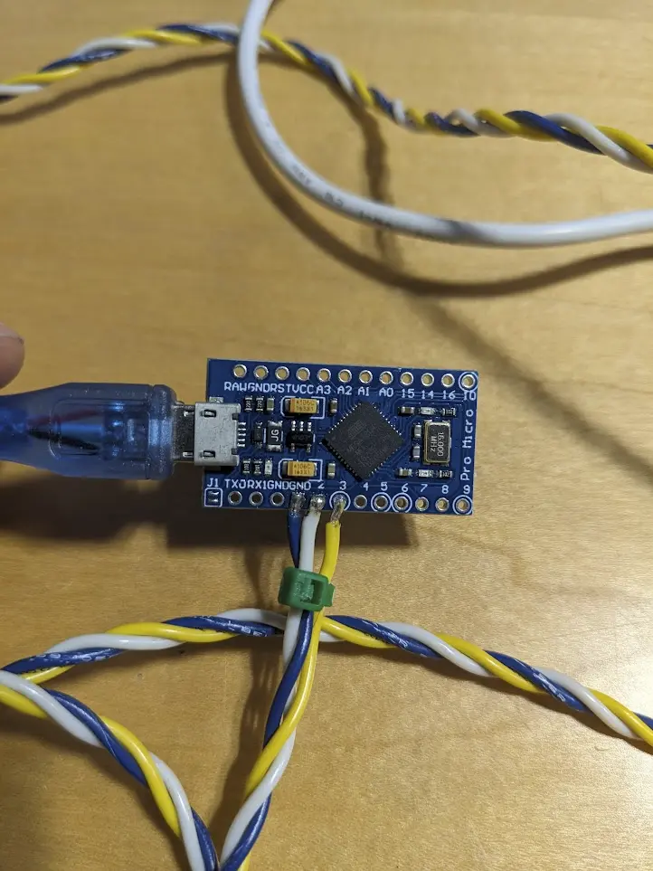

---

This week, I made a major software breakthrough on the ROV.

The IMU will periodically return invalid data, likely due to a faulty sensor. Due to the lack of error handling in the code, the ROV would receive a null value and the enire software system responsible for the control of the ROV would crash and need to be restarted. This bug that I've been tracking for nearly a month now was resolved by simply implenting some basic catches to detect when these null bits come in, and simply ignore them. This luckily has no impact on the ROV's performance, making it a nice and elegant solution.

 

Aside from this, I re-wrote a majority of the code, and improved the layout and readability of it.

This included things like:
- Logging events (errors, status, etc.)
- Error handling
- Software current limiting

I then spent Thursday working on a iambic key, which is a morse code tool used to send CW. I found some available online with hefty pricetags so I decided to go with a more DIY approach.

 

The Arduino Pro Micro here acts as a keyboard HID device. This allows me to use a real iambic keyer on [this website.](https://morse.halb.it/)

I'll make another post later with more in-depth information on the construction of this!