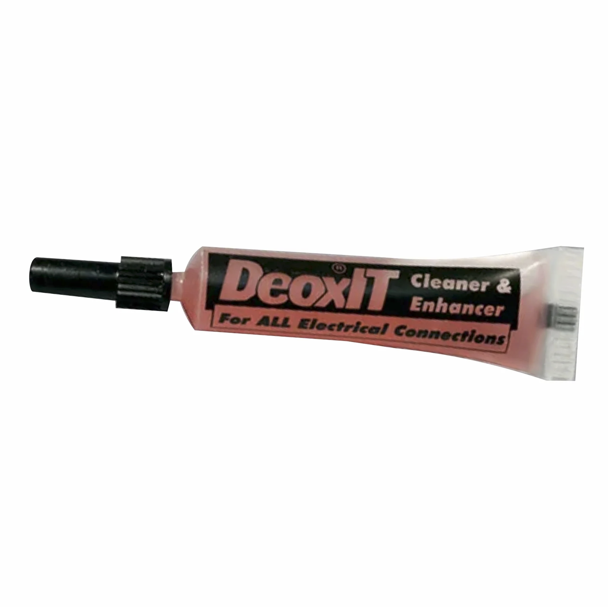

---

As reluctant as I was to do so, I took off all the battery terminals on the Ford Think's battery pack for the trillionth time. I wasn't planning on having to do this, however some of the connections between batteries were so poor (either due to oxidization or loose connections) which caused OVP and UVP to trip on the BMS when charging or discharging. 

I decided to put in the work and take everything apart and clean things thoroughly. This will eliminate this from being a problem which is something that I should have done a long time ago.

In the photo below, you can clearly see the difference between the sanded/ cleaned bus bars versus how they looked before. The change this makes in resistance is pretty significant. 

 

 
  
     
        </img>                                                                           
         

 

 

Additionally, when I put the bars back on, I will be applying a super thin layer of DeoxIT anti-oxidization solution that will hopefully help. The idea is to put on a small amount and then wipe it off. You don't want this to insulate the copper and the battery terminals, so you must be careful when applying it. The idea is that it creates a small barrier that oxygen and moisture cannot penetrate, while keeping metal-on-metal contact ensuring the best electrical connection. This is critical in battery packs that have extremely high discharge current requirements like this one. A layer too thick would prevent spike contact resistance leading to voltage drop and heat. The DeoxIT also fills in any tiny microscopic voids in the bus bar or the battery terminal.

Each bar got it's own special treatment. After being removed from the battery pack, they were laid out in order. Next, I sanded them with aggressive sandpaper to get most of the grim and inconsistencies off the bar. This gives them a shiny finish. After this, I use 2K grit paper which is much softer on the bar and leaves it with a much smoother finish (fewer gaps or ridges that could cause uneven connection of the bars). Finally, I use 90% Isopropyl Alcohol to clean them from dust, oil, and whatever else kind of residue they have.

 

 
  
     
        </img>     
                </img>     
                        </img>                                                                           
         

 

 

I also did a little bit of experimenting with Mr. L involving electroplating the bus bars. This basically creates a very thin layer of metal that encases the copper. This would create a barrier that the oxygen and water cannot penetrate which would prevent corrosion. I tested on unused bus bar in Mr L's DIY nickel electroplating solution. The results were not bad aesthetically.

However, I immediately noticed that after applying high current through the bar and measuring the drop across it, it was over 10x more resistive compared to pure copper. I ultimately decided that the nickel plating wasn't going to be worth the time, and would only make it less performative. 

 

 
  
     
        </img>     
                </img>                                                                        
         

 

 

And on Thursday, to top things off, I began charging a few of the outlier LiFePO4 cells up to the 3.3v that their neighbors were all at. I was lucky enough to borrow Mr. Christy's super precise power supply that made charging them in a controlled manner a breeze.

 

 
  
     
        </img>     
                </img>                                                                        
         

 

I think I will be able to get the golf cart functioning by the end of Friday, but unfortunately everyone reading at home won't see until next week.