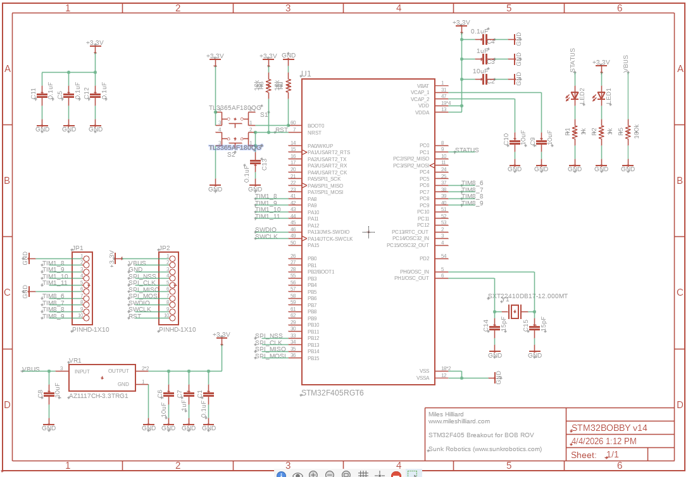

---

The first post of senior year! I am excited, as I know this year will be loaded with lots of exciting work!!

If you recall from the end of last year, I got the new battery system installed and functional before school let out...

On Monday, I just charged the battery fully to make sure that there wouldn't be any potential issues around battery maintenance. 

After doing so, everything seemed to work just as I left it!

 

 
  
     
        </img>                                                                
         

 

 

As a first trial run with it (manually, to check the battery) Jonas and I took the trash up to the dumpster. It was a little much to fit in properly...

 

 
  
     
        </img>                                                                
         

 

 

Nevertheless, everything seemed just fine!

On Wednesday, Jonas and I composed an email that we sent to Vecna Robotics about our LiDAR system. Last year, they donated nearly $200k in LIDAR technology, however they simply cut all the cables to the sensors and left us with no way to interface the modules. 

This is our third email that we've sent to them and we haven't had any response to any...

Hopefully we'll find another contact to reach out to that can help us connect with the engineering department.

While I was sending emails, I shot a couple around to a few of my EE friends. I attached the board layout and schematic to the STM32BOBBY dev board I have been designing for a few months... I wanted to get a few expert thoughts on it before having it made. Thanks to Aaron, Shane, and Scott for giving great suggestions!

Next week (or maybe even this Friday) I'll send it off to JLCPCB to be manufactured and assembled.

Once that comes back in the mail, I will be finally able to test thruster & ESC combo control with the thrusters Tim has been mounting to the ROV itself! I'll need the help of Alachie on the software side of things however.

Stay tuned for next week(s)!