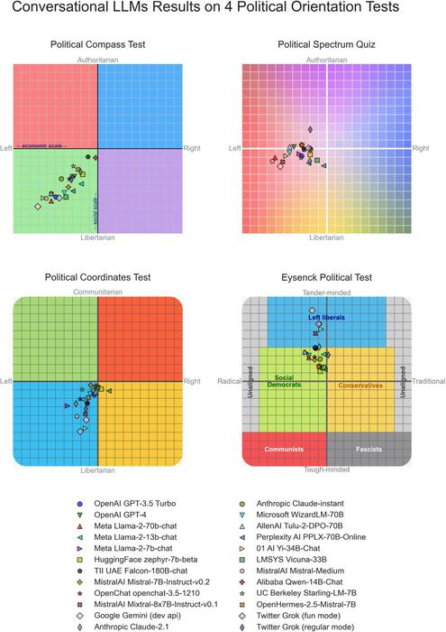

---

## Inro

As Artificial Intelligence expands and continues to get more and more involved in aspects of daily life, it is only a matter of time until it gets involved in mainstream news feeds... so I sped things up and did it myself.

Introducing The Neural Times, your "Only source of news, curated daily"

The Neural Times is uses locally run Large Language Models (LLMs) and locally run Stable Diffusion (for image generation) to create satirical takes on current events worldwide. It then constructs a news article and posts it to the official Neural Times website available at <a href="https://news.sntx.dev">news.sntx.dev</a>. The entire system runs on a computer located in Medford Vocational Technical High School's (MVTHS) Robotics & Engineering shop- AI included. 

This project all started from a simple idea I had: How funny can AI really be? This soon turned into a bit of a rabbit-hole project that I worked on over several months during my free time. But humor wasn't the only thing I had in mind. I also was very curious to see how different LLMs are politically biased, both intentionally and unintentionally. 

## Experiment Conditions

The AI receives inputs from several websites spanning all across the political stage, including:

### Left
- [The Guardian](https://www.theguardian.com)  
- [Mother Jones](https://www.motherjones.com)  
- [HuffPost](https://www.huffpost.com)  
- [The Nation](https://www.thenation.com)  
- [Slate](https://slate.com)  
- [Vox](https://www.vox.com)  
- [Democracy Now!](https://www.democracynow.org)  
- [Daily Kos](https://www.dailykos.com)  
- [Jacobin](https://www.jacobin.com)  
- [ProPublica](https://www.propublica.org)  

### Center-Left
- [New York Times](https://www.nytimes.com)  
- [Washington Post](https://www.washingtonpost.com)  
- [NPR](https://www.npr.org)  
- [Reuters](https://www.reuters.com)  
- [BBC News](https://www.bbc.com/news)  
- [Associated Press](https://apnews.com)  
- [Bloomberg](https://www.bloomberg.com)  
- [Financial Times](https://www.ft.com)  
- [Time Magazine](https://time.com)  
- [The Atlantic](https://www.theatlantic.com)  

### Center
- [Axios](https://www.axios.com)  
- [The Hill](https://thehill.com)  
- [Politico](https://www.politico.com)  
- [Christian Science Monitor](https://www.csmonitor.com)  
- [PBS News](https://www.pbs.org/newshour)  
- [USA Today](https://www.usatoday.com)  

### Center-Right
- [The Wall Street Journal](https://www.wsj.com)  
- [The Economist](https://www.economist.com)  
- [Forbes](https://www.forbes.com)  
- [Fortune](https://fortune.com)  
- [RealClearPolitics](https://www.realclearpolitics.com)  

### Right
- [Fox News](https://www.foxnews.com)  
- [New York Post](https://nypost.com)  
- [The Daily Caller](https://dailycaller.com)  
- [The Blaze](https://www.theblaze.com)  
- [Breitbart](https://www.breitbart.com)  
- [Washington Examiner](https://www.washingtonexaminer.com)  
- [Washington Times](https://www.washingtontimes.com)  
- [Newsmax](https://www.newsmax.com)  
- [National Review](https://www.nationalreview.com)  
- [The Federalist](https://thefederalist.com)  

### Far-Right
- [ZeroHedge](https://www.zerohedge.com)  
- [Gateway Pundit](https://www.thegatewaypundit.com)  
- [OANN](https://www.oann.com)  

### International (mixed biases)
- [Al Jazeera](https://www.aljazeera.com) (Qatar, center-left)  
- [Der Spiegel](https://www.spiegel.de/international) (Germany, center-left)  
- [Le Monde](https://www.lemonde.fr) (France, left)  
- [France24](https://www.france24.com)  
- [Reuters World](https://www.reuters.com/world)  
- [Sky News](https://news.sky.com) (UK, center-right)  
- [The Times (UK)](https://www.thetimes.co.uk)  
- [RT](https://www.rt.com) (Russia, state-aligned)  
- [NHK World](https://www3.nhk.or.jp/nhkworld) (Japan)  
- [Haaretz](https://www.haaretz.com) (Israel, left)  
- [Jerusalem Post](https://www.jpost.com) (Israel, right)  

Other's have done comprehensive studies in and around this topic, including [www.eurekalert.org](https://www.eurekalert.org) of which this graph comes from:

The models used/ tested/ under current testing by The Neural Times include the following self-hosted models from ollama:

The experimentation I am doing is still not complete, as I haven't collected enough data to make any significant plots or graphs to help digest any bias present in the AI's writing, but that day will come down the road. For now, the more exposure the models have to writing, the more accurate my conclusions can be.

## Conclusion

Although I was genuinely curious to see how bias was baked into these AI models, my take was significantly less scientific and serious compared to others. The Neural Times focuses mostly on humorous articles that are completely AI written and interpreted and the whole concept was more of an experiment to learn about self-hosting large AI models, and making a functional autonomous system with them.

So far, I will not draw any conclusions on how the AI writes... other than the fact that it seems like it's pretty funny for the most part.

The articles it writes are often extremely offensive, however, it equally offends everyone which.

I would love to hear your conclusions on this. Let me know what you think about it, any suggestions you have, or details you think should be included in this study/ project in the comments below.