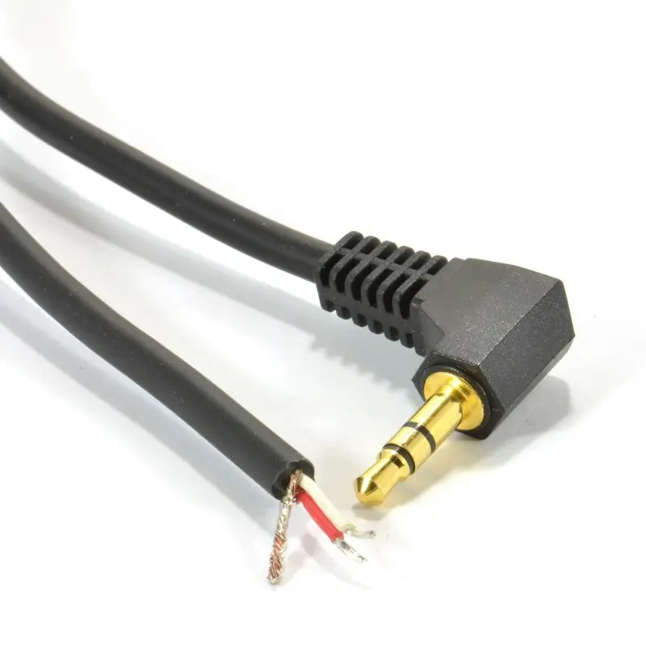
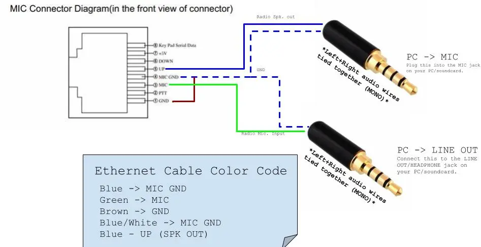

---

## Introduction

Today, I will walk you through how to create a cable for your Anytone AT778 or Retevis RT95 ham radio, enabling you to both send and receive digital modes. This post is very similar to my old one on making a <a href="/posts/uv5r-audio-pc/">digital audio cable Baofeng UV5R.</a> Check that out if you have a UV5R. If you want custom cable instructions, just ask and I'll help you out!

This cable will allow you to both RX and TX any digital mode from your laptop, including (but not limited to)...
- CW (<a href="https://morse.mileshilliard.com/">Morse Code</a>)
- APRS
- Packet Radio (e.g. ax.25)
- RTTY
- SSTV
- FT8
- JS8Call  

et al.

---

## Materials

You'll need the following parts to make this work:
- [Radio (RT95 or AT778)](https://www.ebay.com/sch/i.html?_nkw=anytone+778)
- [3.5mm male-male audio cable](https://www.ebay.com/sch/i.html?_nkw=3.5mm+audio+cable+male+to+male)
- [Ethernet Cable (CAT5 or CAT6)](https://www.ebay.com/sch/i.html?_nkw=ethernet+cable+short)
- Optional - (don't need if your PC has a seperate MIC and HEADPHONE jack) [USB Sound Card](https://www.ebay.com/sch/i.html?_nkw=usb+sound+card)
- Optional - [Perf/Development PCB board](https://www.ebay.com/sch/i.html?_nkw=perf+board)

---

## Construction

### Audio & Ethernet Cable

Cut the Male-Male 3.5mm audio cable in half and strip the ends of the cable to reveal the 3 wires inside.

The colors will vary depending on your cable; typical color code is as follows:

**RED -> Right Audio**  

**BLACK/WHITE -> Left Audio**

**EXPOSED WIRE -> Ground/GND**

If you are unsure of you situation, use a multimeter in continuity and probe the jack and wires to determine your own cable-specific pinout.

Basically do the same thing to the ethernet cable. Cut it in half and carefully expose the wires' ends inside. If you are using Cat5 cable, then the wiring should be straightforward, as the cables are color coded pretty universally.

 

## Wire it up

With your now exposed wires, solder the connections in the appropriate manner as shown in the image below.

You can solder them directly to each other, and wrap the connections in electrial tape or heat shrink, but I prefer cutting a small piece of perf board, and soldering the wires to that. It makes the connections more secure and permanent. Ultimately, this is up to you, and depends on what materials you have available.

    
    </img>
     
    
    </img>

I covered mine in hot glue and zip-tied the cables to make sure they wouldn't come out
 
 

## Testing it out

Now that you have your cable made, you can try it out on your radio!

    
    </img>
     
    <iframe src="https://www.youtube.com/embed/zi9G_IENgpE?si=492JwDWoQTw8I-dD" title="YouTube video player" frameborder="0" allow="accelerometer; autoplay; clipboard-write; encrypted-media; gyroscope; picture-in-picture; web-share" referrerpolicy="strict-origin-when-cross-origin" allowfullscreen style="display: block; margin-left: auto; margin-right: auto; width: 47%;" ></iframe>

 
73 de KC1VTJ

