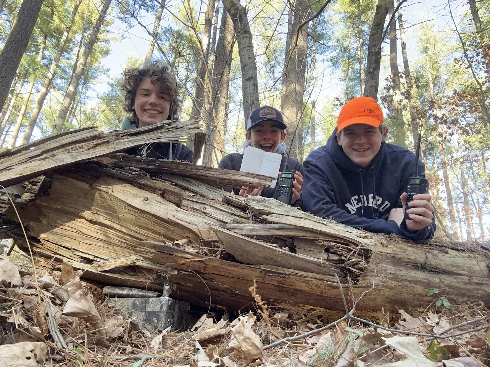

---

Over the weekend, me and two of my friends went out foxhunting. On the groups.io page, we found a few local foxes that had been set up. We took the opportunity to drive 30 minutes North to see what we could find!

Since we all got our radio licenses around the same time, we all purchased the same, budget-friendly HT: the Baofeng UV-5R. We brought along for with us for the endeavor, and an assortment of various antennas- from long whips to little stubbies. Funnily, almost all of them were of use to us.

The first fox we could not find. Likely, the TX power was too high. There were many hills in the woods where we searched, so reflections led us to multiple dead ends before we gave up an tried another one. Only a two minute drive away was another one transmitting at 50mW which was much more manageable. 

After about 45 minutes of searching, we spotted it!

Our technique was basically just holding the HT close to our chest while listening to the fox transmission and spinning slowly. When we heard the signal get weaker or go away completely, it meant that it was likely coming from behind us (direction our back is facing). We didn't have a yagi or any directional antenna for that matter, but it seemed to work out just fine for us. I will probably try making the tape measure yagi before the next time we go out.