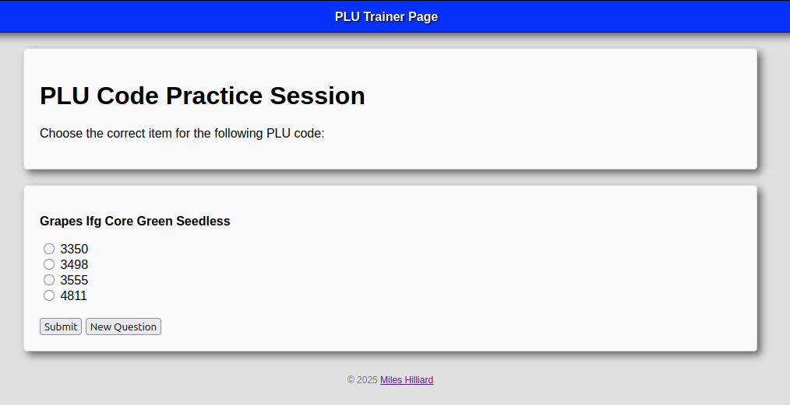
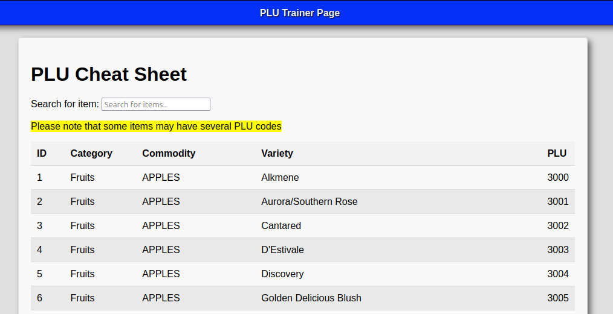

---

PLU Codes are super hard to remember, especially if you are a new cashier at your local supermarket like me. 

Although most modern systems include a lookup utility to help you look up codes when you can't remember them, it can be super time consuming and annoying to both you and the customer.

With a little research, I found few resources to help study these codes. Most people I have talked to, including my coworkers, say that memorization comes with time. Although this is probably true, do yourself a favor and speed it up a little!

Introducing my <a href="https://plu.mileshilliard.com/"><b>PLU Trainer</b></a>.

Now, practicing PLU codes is easier than ever. So far, I have found repetition to be the most effective way of memorization. If this is you, give the PLU Trainer website a try. 

With flash-card based questions, you can study codes at lightning speed, at any time. Waiting for the bus? Start studying! Turn every opportunity into a time to practice.

With an easy-to-use interface, studying suddenly becomes easier than ever. No sign up or anything required.

Need a quick way to look up a certain PLU, Produce Category, Commodity, or Variety of an item? Try the <a href="https://plu.mileshilliard.com/docs"><b>Cheat Sheet</b></a> with a built-in search function. Search over 1.5k PLUs to find exactly what you are looking for.

The database used in this project was provided by <a href="https://www.ifpsglobal.com/">The International Federation for Produce Standards (IFPS)</a>, where the data is curated and kept up-to-date with all PLUs at major grocery stores.

With more quiz-based practices coming up in the future, you can practice identifying PLU codes based on item images amongst other features.