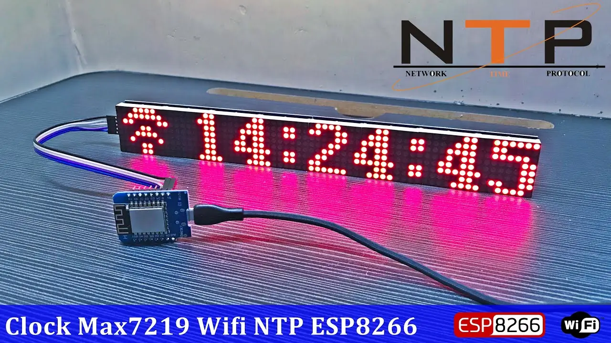
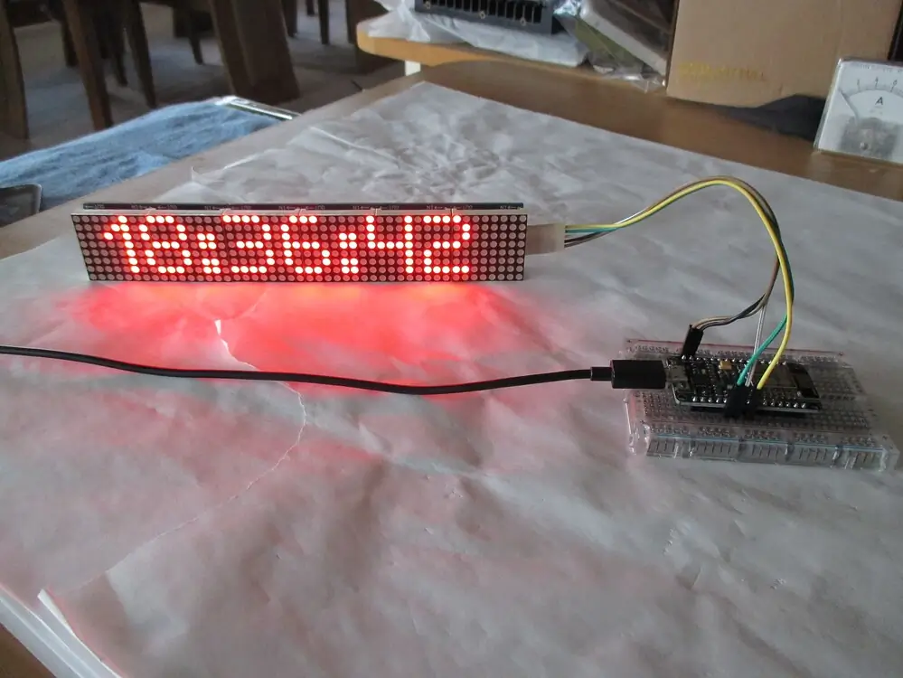
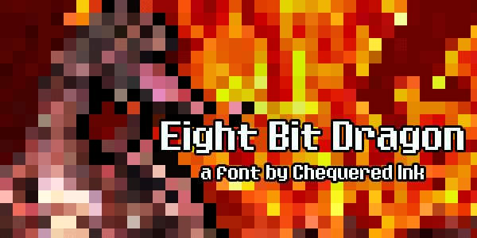
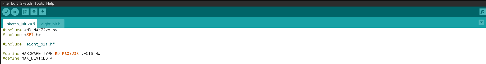
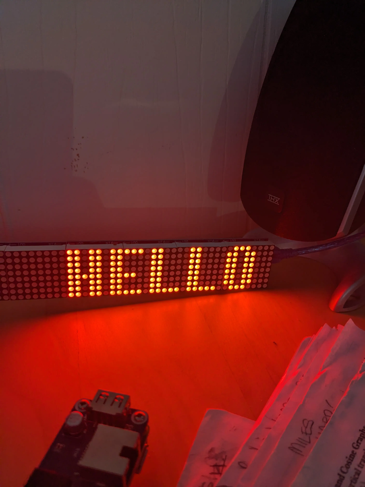

---

You may have seen those cool fonts some people use on their MAX7219 displays, well now you can create your own custom fonts for your MAX7219 displays!



Without some additional software, the only fonts you can use are the ones included in the library you are using. While there are a good variety of fonts available, they may not always be what you are looking for.

In the case of MD_PAROLA (common C++ based library for the MAX7219), the fonts are compiled into the program. This means that you cannot just add a font to your project on the fly. You have to recompile the program with the new font. The standard ones look like this... a bit bland...



## Create a font (OR download one)

To create your own font, you will need to use a font editing program. I recommend using FontForge. It is a free and open source font editor that is available for Linux, macOS, and Windows.

Once you have FontForge installed, you can create a new font and add your own custom characters. For the MAX7219, you will need to create a font that is 8 pixels tall and 8 pixels wide. 

There are several tutorials online for creating fonts in FontForge, but the basic idea is to create a new font, add your custom characters, and then export the font as a TrueType font file. (.ttf)

If you don't want to make a custom font, then you can simply search and download one that you like from the internet. I found this one and wanted to give it a shot.

[Eight Bit Dragon](https://www.dafont.com/eight-bit-dragon.font)



MD_PAROLA does not support custom fonts out of the box, so we will need to use a script to convert the font to a format that MD_PAROLA can use. 

## Convert font

I built a small python script to simplify this process. It is a CLI tool that you can use to easily convert fonts for use with MD_PAROLA.

It is available on GitHub: [max7219-fonts](https://github.com/syntaxerror019/max7219-fonts)

To install, git clone the repo, install requirements, run the script, and you are good to go!

```bash
git clone https://github.com/syntaxerror019/max7219-fonts
pip install -r requirements.txt
Example: python3 main.py -o fonts/eight-bit-dragon.otf -e fonts_h/eight_bit.h -n eight_bit_font
```

-o for the input file (TTF, OTF)
-e for the output header file
-n for the name of the font (this is what you will use in your code)

## Use font

Open up Arduino IDE and click on Sketch > Add file... > your_font_name.h

This will create a secondary tab in your Arduino IDE that looks like this:



In your main program, add the code found in the `arduino_example` > `example.ino` folder in the repo you cloned! 

Upload the code to your ESP32/Arduino and you should see your new font in action! 

