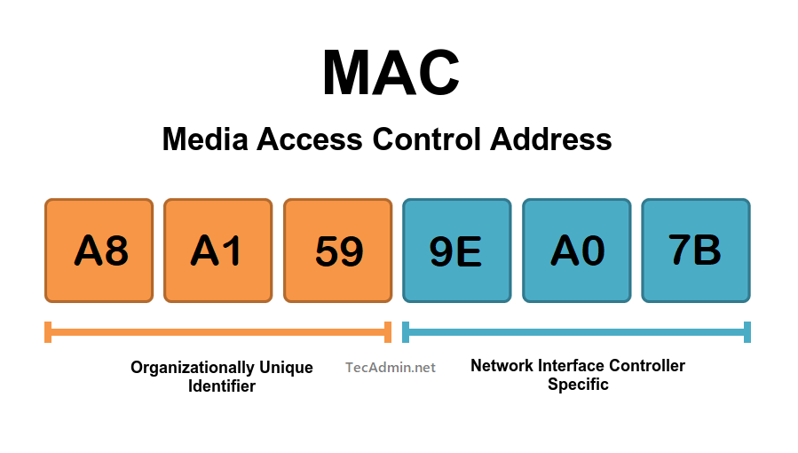
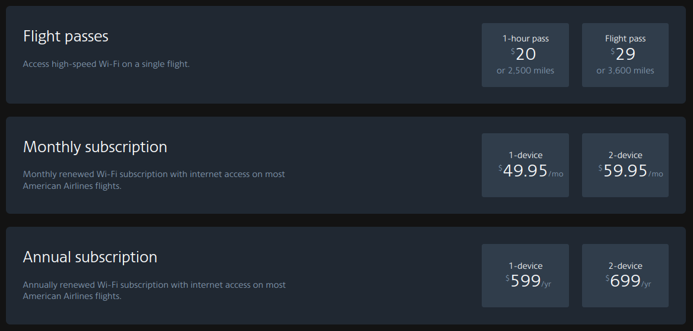

---

On most airlines today, you are given "free" WiFi during your flight. In reality, this looks more like "20 minutes for free, then $30 for the rest of the flight." Although the airlines occasionally offer a basic streaming service for free, the movie selection is usually abysmal and can be very laggy and unreliable during playback. 

Although I don't travel by plane frequently, usually it is for very long trips. I immediately decided that there had to be something that could be done to bypass this system. Long story short, it works, and I'm writing this from 30,000 feet!

For those who are not aware, simply refreshing the page or trying to get another 20 minutes from the captive portal doesn't work. This is because the backend server is aware of the device and knows if you have already requested for 20 minutes of free service. However, if you grab another device (latop, tablet, etc.) and try again, it will grant you another 20 minutes.



Learn more about MAC addresses <a href="https://tecadmin.net/media-access-control-address/">here</a>

So, the real question is how do they know if I have already requested for WiFi?

## How do they know me??

And the answer isn't particularly straightforward. In today's world, tracking is baked into almost every application, website, and service imaginable. However, for "less-sophisticated" services like airline WiFi, things are usually limited to one or more of the following methods of identification.

1) They monitor your MAC address (physical card address) to distinguish different devices and people.
2) They track browser user-agents and digital fingerprints (screen dimensions, browser behavior, etc.)
3) They set a cookie on your device after using the 20 minutes of service the first time.

Obviously, the system applied varies between every airline and system behind it.

## Bypassing the limitation


Although it is hard to know the system applied, there are a few tricks you can try to get around their limit of free WiFi to get yourself unlimited WiFi throughout your entire flight.

Likely, they are seeing that your device has the same MAC address. No matter what you do (VPN, new browser, clearing history) they will still be able to easily identify you.

Most phones (and computers) support dynamic MAC addresses that change by themselves to help preserve your anonymity and make you harder to track (especially on public networks). I tried this on my phone, however it didn't do the trick. I'm not sure if it's enough to mask the hardware address. The same thing happened on my Ubuntu laptop.

On my laptop, I installed a nice piece of software called `macchanger` which makes changing your MAC address super duper easy with a single command.

I first connected to the WiFi the first time (for free, like normal) and installed this tool with the following command:

```bash
sudo apt update
sudo apt upgrade -y
sudo apt install macchanger
```

After letting things finish, I checked ut the `help` page for it.

```txt
GNU MAC Changer
Usage: macchanger [options] device

  -h,  --help                   Print this help
  -V,  --version                Print version and exit
  -s,  --show                   Print the MAC address and exit
  -e,  --ending                 Don't change the vendor bytes
  -a,  --another                Set random vendor MAC of the same kind
  -A                            Set random vendor MAC of any kind
  -p,  --permanent              Reset to original, permanent hardware MAC
  -r,  --random                 Set fully random MAC
  -l,  --list[=keyword]         Print known vendors
  -b,  --bia                    Pretend to be a burned-in-address
  -m,  --mac=XX:XX:XX:XX:XX:XX
       --mac XX:XX:XX:XX:XX:XX  Set the MAC XX:XX:XX:XX:XX:XX

Report bugs to https://github.com/alobbs/macchanger/issues
```

I then checked the name of my WiFi card on my laptop with

```bash
sudo ip link show
```

Usually, you will see something like `wlan0` or `eth0` but in my case, the device was named `wlp1s0`

With this, you can now change your MAC address (replace `wlp1s0` with your address):

```bash
sudo macchanger -r wlp1s0
```

which will grant you a brand new, randomized MAC!

If it yields some error, try disabling your WiFi card before running `macchanger` (replace `wlp1s0` with your address)

```bash
sudo ip link set wlp1s0 down
sudo macchanger -r wlp1s0
sudo ip link set wlp1s0 up
```

Now, connect back to the WiFi network (aainflight.com on American Airlines for me) and try to get another 20 minutes of WiFi. Chances are, the server will see you as a new device and grant you more time! Run the `macchanger` command shown above every time you run out of internet and you're good to go.


To make this a bit easier, I made the following shell file to automate everything:

```shell
#!/bin/bash
echo "\n [OK] Stopping WIFI (wlp1s0) network..."
sudo ip link set wlp1s0 down

echo " [OK] Changing MAC address..."
sudo macchanger -r wlp1s0

echo " [OK] Starting WIFI (wlp1s0) back up..."
sudo ip link set wlp1s0 up
```

Put this into a file ending in `.sh` and then run the following to make it executable.

```bash
chmod +x <your_shell_file>.sh
```

Now, you can run:

```bash
./mac-change.sh
```
(Replace with your file)



I found that this worked very reliably on both my flights on American Airlines, however if you are still encountering issues on your airline, try changing your browser setup additionally.

To do this, open up your browser and press `CTRL+SHIFT+I` to open up the developer tools. You can try one or more of the following to see if a combination works for you:

* Change device dimensions (top bar on Firefox)
* Choose preset to spoof device (top bar on Firefox)
* Change the User Agent to that of another computer or phone

Additionally, I would recommend doing all this in another profile (Chrome, Firefox, Etc.) from your main profile to make it look even more varied, or clear all of the history and cookies in your existing profile. This will help to fool the server to make it think its seeing a new device.

Hopefully these solutions prevent you from paying a fortune next time you try to get internet on your flight!

If you have questions or comments, leave them below and I'll try to help out ASAP!

[End Post]