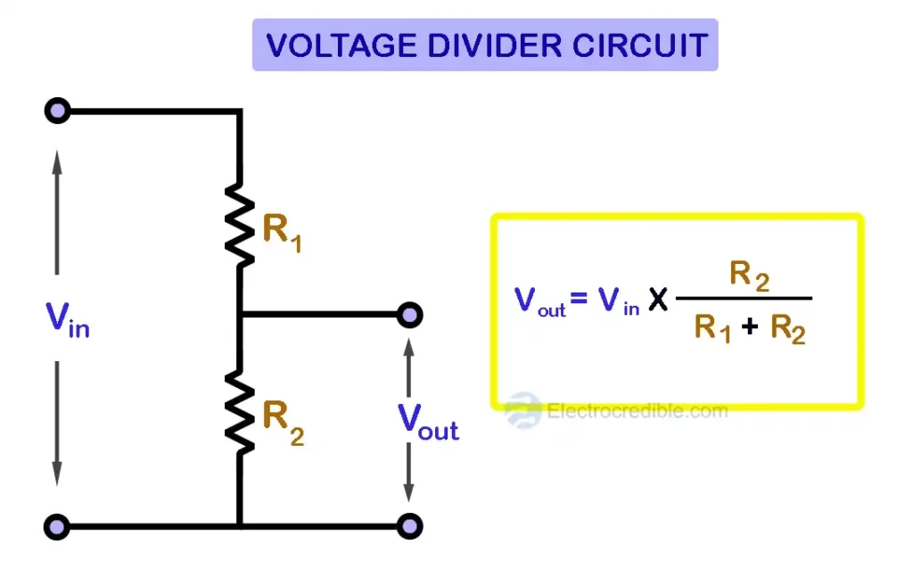
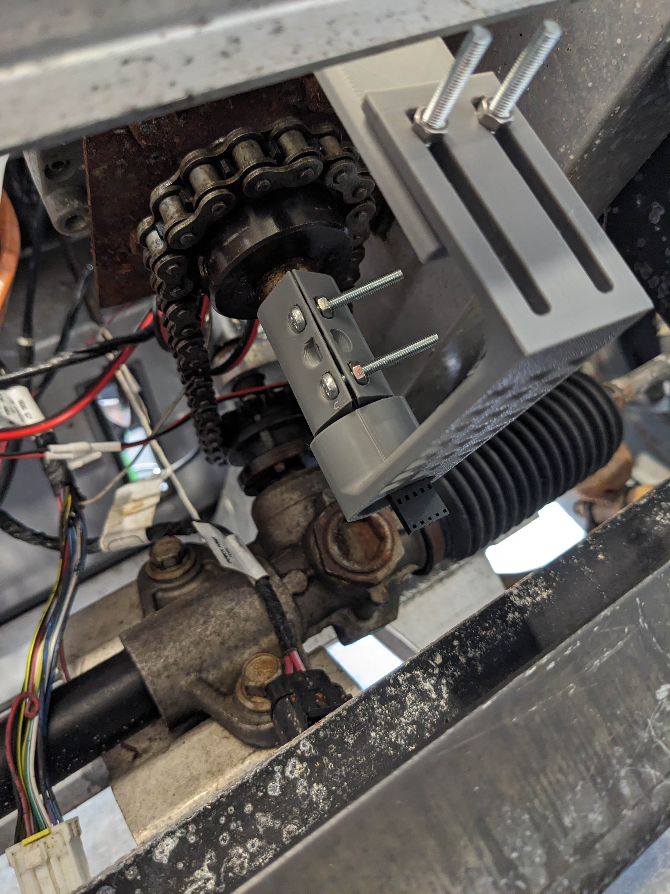
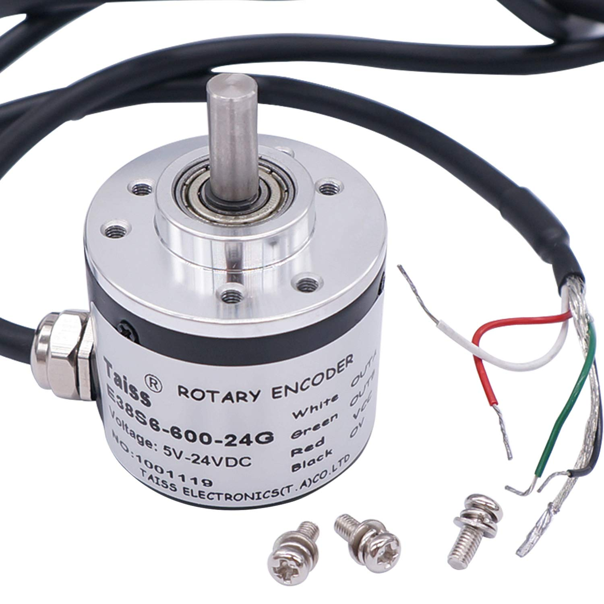

This week was our first full week of school, and I wanted to take advantage of that, however I was out sick on Thursday which didn't help. 

Nonetheless, I made a big discovery as to why I was having such a difficult time controlling the golf cart's throttle via serial. I talked to Roman Rice, the creator of the driver board, and we determined that the issue I was experiencing was not a software issue. This was proven on Tuesday when I discovered I was able to consistently either make the vehicle accelerate full speed forwards or reverse. The only thing I could not change was the acceleration. 

I believe the reasoning behind this is because the DAC is not functioning as expected. As I write this post (on Thursday) I plan to use an oscilloscope to check the output of the DAC chip to check whether it is outputting a voltage between 0 and 5v. 

To explain why this is important, we must understand how the golf cart understands what pressing the gas pedal even means. The pedal is mechanically attached to a potentiometer. The potentiometer changes resistance as it's position changes. By applying power to it, as the potentiometer moves, it creates a voltage difference (or an adjustable voltage divider). 



This difference in voltage creates 0v when the pedal is not pressed and rises as the pedal is pressed all the way up to 5v. Now, to simulate this programmatically, we use a DAC or Digital to Analog Converter. This particular DAC chip that is used on the golf cart can produce anywhere from 0 to 5v DC and can be set programatically via I2C. Now, what would happen if this chip was not functioning as expected? There is a good chance that the chip is constantly outputting 5v no matter what signal is sent to it. 

I am pretty sure this is the case, because when I set the throttle to \~50% speed and tell it to go forwards, the vehicle accelerates at full speed. If I also read the speed back, the driver still thinks it is accelerating at 50%. This narrows things down and tells us that our issue is in fact a hardware issue and not something wrong with our code!

```plain
$ACCEL=50\n
ok
$FORWARD=1\n
ok
$REVERSE=0\n
ok
$START=255\n
ok
```

The response from the command `$ACCEL` which reads the current acceleration set is `50` which is exactly what I set it to. Then why is it accelerating at full speed? It it likely the DAC!

On Wednesday, Jonas and I were driving the car when it suddenly stopped responding to steering commands and started steering full right. This was pretty scary, but we quickly discovered that our rotary encoder had seized up completely and was impossible to rotate. I think that some dust got inside and did internal damage to it. Granted, it was designed for something experiencing a lot less mechanical stress, like a thermostat dial.



At the end of the day, Jonas and I settled on this new encoder which is IP65 and will be much better suited for our application in the dirt and rain this will be driving through. Additionally, it makes 600 pulses per revolution compared to the 24 of the old one! This will make it much more accurate and precise when steering!


