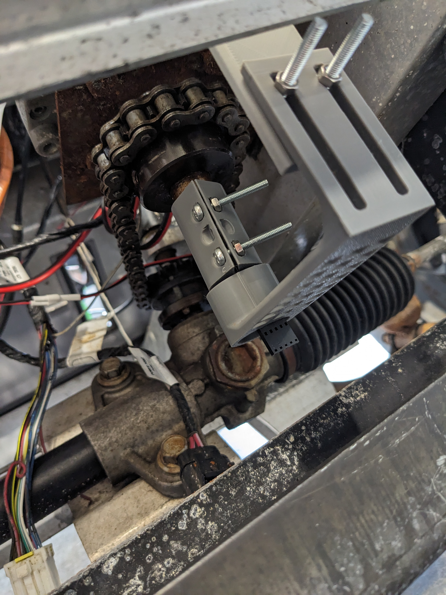
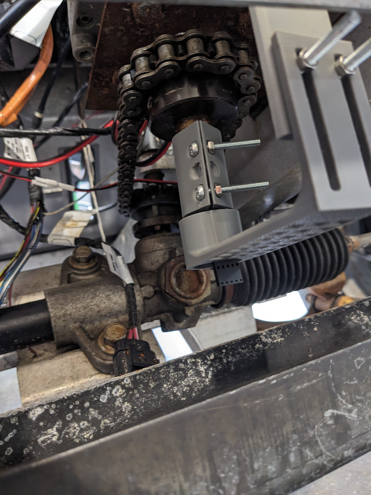
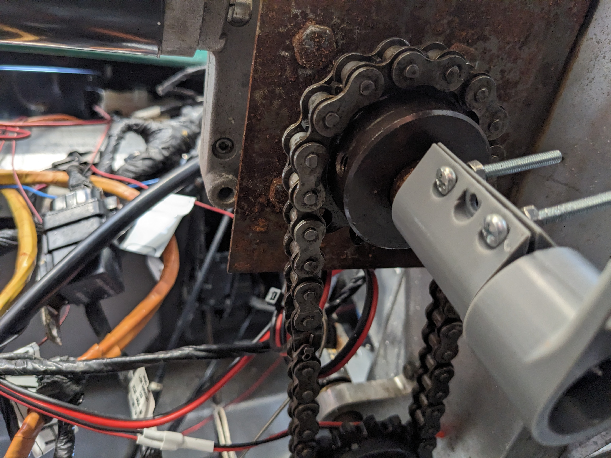

This week in shop, I spent my time getting the encoder steering working on the golf cart. I set up the steering coder, so when the wheel is turned left or right, it can track the position. With the AI system, the cart can lock on to a target. The next step will be to add a PID system, which will strengthen it against confounding factors. 

Additionally, I communicated with VECNA Robotics over email, in order to acquire a new control box for the lidar system on the golf cart. I emailed PCB Way--the new shop sponsor-- to see if they'd be interested in sponsoring the Robotics Team. I will continue to work with them, to broker a deal and secure high grade materials for the shop.
